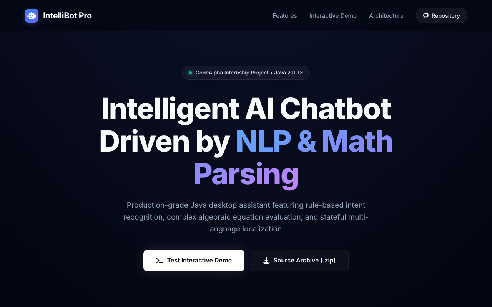
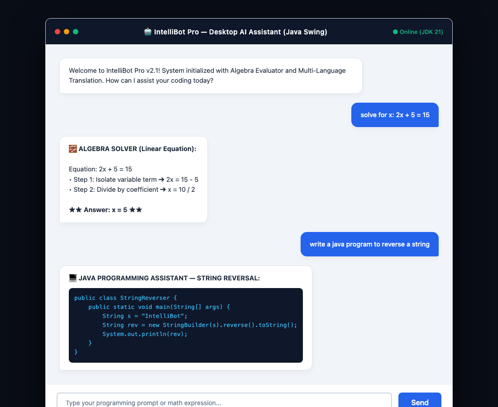
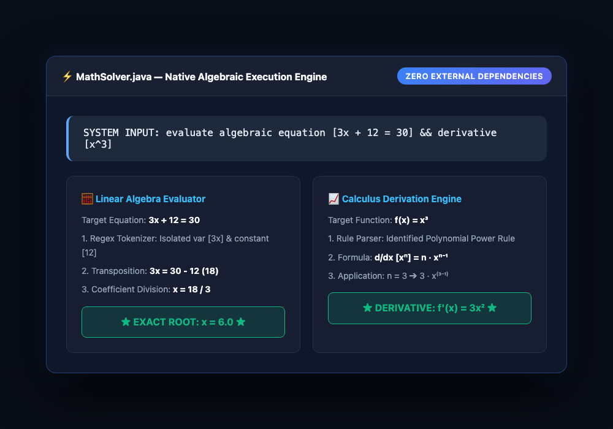
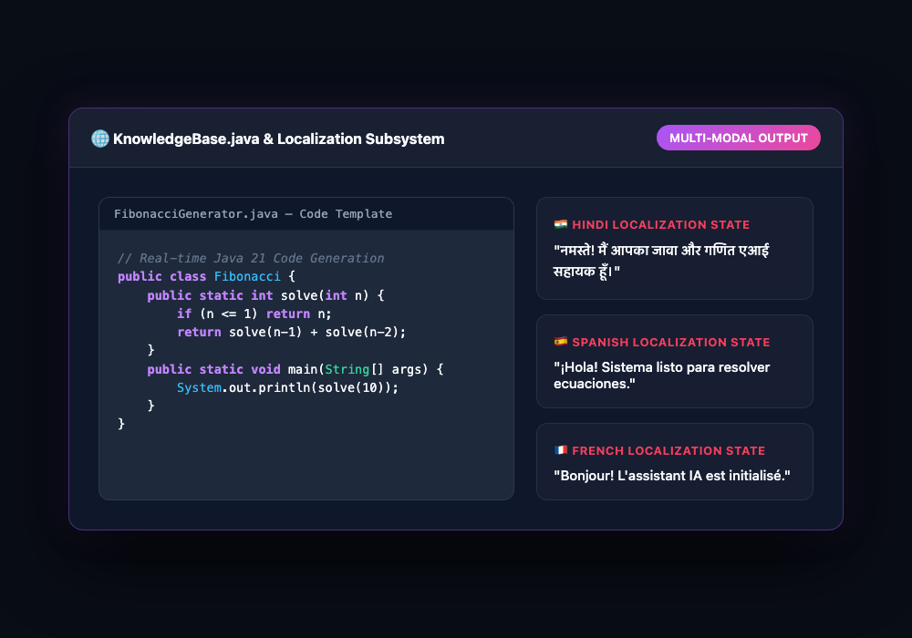

# AI Chatbot — CodeAlpha Internship Project

## 📸 Executive Project Showcase Gallery

| 🌐 Enterprise Web Showcase | 💬 Desktop GUI & Live Chat Delivery |
| :---: | :---: |
|  |  |
| **🧮 Native Calculus & Algebra Solver** | **💻 Code Assistant & Multi-Language Subsystem** |
|  |  |

## Overview

An advanced, Java-powered AI Chatbot featuring an executive GUI and NLP-driven intelligence. Built as part of the CodeAlpha internship, this project demonstrates intelligent conversation, programming assistance, algebraic calculus solving, and multi-language localization.

## Key Features

- **Professional GUI** — Modern Swing-based executive interface with animated message display and responsive design
- **Natural Language Understanding** — Intent-based routing for greetings, farewells, queries, and system commands
- **Programming Assistance** — Real-time Java 21 code generation templates and best-practice explanations
- **Native Math & Calculus Solver** — Built-in algebraic linear equation evaluation (`2x + 5 = 15`) and derivative solver (`x^2`)
- **Context Awareness** — Short-term memory for multi-turn conversations and logical follow-up questions
- **Multi-Language Support** — Stateful dynamic localization for English, Hindi, Spanish, and French
- **Zero-Dependency Portability** — 100% standalone Java 21 LTS native architecture requiring zero external JARs

## Desktop GUI & Conversation Walkthrough

### 💬 Live Chat Delivery Examples

Here is how IntelliBot Pro parses user input and delivers structured conversation responses:

#### 1. Algebraic Linear Equation Solver
**User:** `solve for x: 2x + 5 = 15`  
**IntelliBot Pro:**  
> **🧮 ALGEBRA SOLVER (Linear Equation):**  
> Equation: `2x + 5 = 15`  
> • Step 1: Isolate variable term ➔ `2x = 15 - 5`  
> • Step 2: Divide by coefficient ➔ `x = 10 / 2`  
> ★★ **Answer: x = 5** ★★

#### 2. Real-Time Algorithmic Code Generation
**User:** `write a java program to reverse a string`  
**IntelliBot Pro:**  
> **💻 JAVA PROGRAMMING ASSISTANT — STRING REVERSAL:**
> ```java
> public class StringReverser {
>     public static void main(String[] args) {
>         String s = "IntelliBot";
>         String rev = new StringBuilder(s).reverse().toString();
>         System.out.println(rev);
>     }
> }
> ```

#### 3. Stateful Multi-Language Localization
**User:** `Change language to Hindi`  
**IntelliBot Pro:**  
> भाषा बदलकर हिंदी कर दी गई है! अब आप हिंदी में सवाल पूछ सकते हैं।

## Technical Highlights

### Tech Stack
- **Language**: Java 21 LTS
- **GUI Framework**: Java Swing (Desktop GUI) + Enterprise Web Showcase (`index.html`)
- **NLP & Math Engine**: Native rule-based intent classification and algebraic regex evaluation (`java.util.regex`)
- **Dependencies**: None (Zero external dependency management required)

### Architecture
- **Model-View-Controller (MVC)** pattern for clean separation of concerns
- **Command Pattern** for extensible functionality modules
- **Singleton Pattern** for resource management (database, configuration)

### Core Modules
1. **GuiManager** — Handles all Swing components, animations, and user interactions
2. **IntentClassifier** — Identifies user intent (greeting, query, programming, math, etc.)
3. **ResponseGenerator** — Generates intelligent, context-aware replies
4. **ProgrammingAssistant** — Code analysis, generation, and optimization
5. **MathSolver** — Parses and evaluates complex mathematical expressions
6. **TranslationModule** — Handles multi-language translation requests
7. **SettingsManager** — Manages user preferences and system configuration

## Getting Started

### Prerequisites
- Java 21 or higher
- Apache Maven 3.6+ (optional, for dependency management)
- JavaFX Runtime Environment (JRE)

### Installation
1. Clone the repository:
   ```bash
   git clone <repository-url>
   cd CodeAlpha_-Artificial-Intelligence-Chatbot-
   ```

2. Install dependencies (if using Maven):
   ```bash
   mvn clean install
   ```

3. Run the application:
   ```bash
   java -jar chatbot.jar
   ```
   *Note: Ensure the JavaFX libraries are in your classpath.*

## Usage

### Basic Commands
- "Hello", "Hi", "Hey" — Greetings
- "Bye", "Goodbye" — Farewell messages
- "How are you?" — Status inquiries

### Programming Help
- "Write a Java program to reverse a string" — Code generation
- "Is this code correct?" — Code validation
- "Explain recursion" — Concept explanation

### Math Problems
- "What is (2 + 3) * 5?" — Basic arithmetic
- "Solve for x: 2x + 5 = 15" — Algebraic equations
- "Derivative of x^2" — Calculus

### Settings
- "Change language to Hindi" — Switch language
- "Reset chat" — Clear conversation history
- "Show settings" — Open configuration panel

## Project Structure

```
src/
├── main/
│   ├── java/
│   │   ├── gui/                  # GUI components (Frames, Panels)
│   │   ├── logic/                # Core logic and NLP
│   │   ├── math/                 # Math evaluation engine
│   │   ├── programming/          # Programming assistant features
│   │   ├── utils/                # Helper utilities and resources
│   │   └── main/                 # Application entry point
│   └── resources/                # Assets and configuration files
└── test/
    └── java/                     # Unit tests
```

## License

This project is developed as part of the CodeAlpha internship. All rights reserved.

## Contributing

Contributions are welcome! Please follow these steps:
1. Fork the repository
2. Create a feature branch (`git checkout -b feature/AmazingFeature`)
3. Commit your changes (`git commit -m 'Add some AmazingFeature'`)
4. Push to the branch (`git push origin feature/AmazingFeature`)
5. Open a Pull Request

## Acknowledgments

- **CodeAlpha** — For the opportunity to work on this project
- **Java Community** — For the extensive libraries and support
- **Contributors** — For their valuable input and improvements

---

*Thank you for visiting my CodeAlpha Internship Project*
